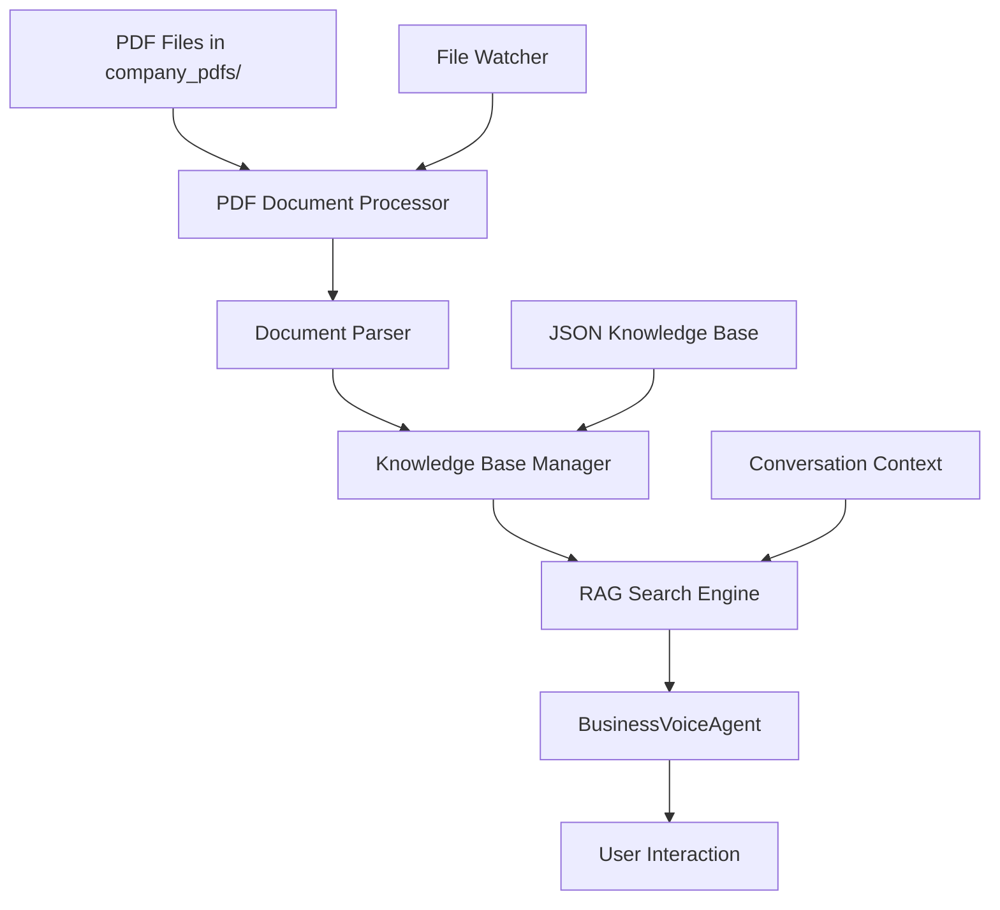

# Design Document

## Overview

This design document outlines the implementation of PDF reading capabilities, document parsing functions, knowledge base integration, and RAG (Retrieval-Augmented Generation) system for the BusinessVoiceAgent. The system will process PDF documents from the `company_pdfs` directory and integrate them seamlessly with the existing voice agent without requiring ChromaDB or vector database implementation.

The design focuses on creating a lightweight, file-based RAG system that can be easily integrated with the existing LiveKit-based voice agent architecture.

## Architecture

### High-Level Architecture



### Component Interaction Flow

1. **PDF Processing Pipeline**: PDF files → Text extraction → Document parsing → Knowledge storage
2. **RAG Query Pipeline**: User query → Context analysis → Document search → Response generation
3. **Knowledge Integration**: PDF content + JSON knowledge base → Unified search interface
4. **Real-time Updates**: File system monitoring → Automatic reprocessing → Live knowledge updates

## Components and Interfaces

### 1. PDF Document Processor

**Purpose**: Extract and process text content from PDF files in the company_pdfs directory.

**Key Classes**:

- `SimplePDFProcessor`: Main processing class without vector DB dependencies
- `PDFTextExtractor`: Handles text extraction using PyPDF2/pdfplumber
- `DocumentStructureAnalyzer`: Identifies document types and structures

**Interface**:

```python
class SimplePDFProcessor:
    def __init__(self, pdf_directory: str = "company_pdfs")
    async def process_all_pdfs() -> List[ProcessedDocument]
    async def process_single_pdf(pdf_path: str) -> ProcessedDocument
    def get_supported_types() -> List[str]
```

### 2. Document Parser

**Purpose**: Parse different PDF document types and extract structured information.

**Key Classes**:

- `DocumentTypeDetector`: Identifies document type (FAQ, policy, procedure, manual, general)
- `FAQParser`: Extracts question-answer pairs from FAQ documents
- `PolicyParser`: Extracts sections and subsections from policy documents
- `ProcedureParser`: Identifies step-by-step instructions
- `GeneralParser`: Handles unstructured content

**Interface**:

```python
class DocumentParser:
    def parse_document(content: str, doc_type: str) -> ParsedDocument
    def detect_document_type(content: str, filename: str) -> str
    def extract_sections(content: str) -> List[DocumentSection]
```

### 3. Knowledge Base Manager

**Purpose**: Manage integration between PDF content and existing JSON knowledge base.

**Key Classes**:

- `UnifiedKnowledgeBase`: Combines PDF and JSON knowledge sources
- `KnowledgeIndexer`: Creates searchable index of all content
- `ContentMerger`: Handles duplicate detection and content prioritization

**Interface**:

```python
class UnifiedKnowledgeBase:
    def __init__(self, json_kb_path: str, pdf_content_path: str)
    def load_all_knowledge() -> Dict[str, Any]
    def search_content(query: str, context: str = None) -> List[SearchResult]
    def update_from_pdfs(pdf_documents: List[ProcessedDocument])
```

### 4. RAG Search Engine

**Purpose**: Implement retrieval-augmented generation without vector databases.

**Key Classes**:

- `SimpleRAGEngine`: Main RAG implementation using text-based search
- `ContextualSearcher`: Performs context-aware content retrieval
- `ResponseSynthesizer`: Combines retrieved content with LLM capabilities

**Interface**:

```python
class SimpleRAGEngine:
    def __init__(self, knowledge_base: UnifiedKnowledgeBase)
    async def search_and_generate(query: str, context: str) -> RAGResponse
    def rank_results(results: List[SearchResult], query: str) -> List[SearchResult]
    def synthesize_response(query: str, results: List[SearchResult]) -> str
```

### 5. File System Monitor

**Purpose**: Monitor PDF directory for changes and trigger automatic updates.

**Key Classes**:

- `PDFDirectoryWatcher`: Monitors company_pdfs directory
- `ChangeHandler`: Processes file system events
- `UpdateScheduler`: Manages incremental updates

**Interface**:

```python
class PDFDirectoryWatcher:
    def __init__(self, directory: str, callback: Callable)
    def start_monitoring()
    def stop_monitoring()
    async def handle_file_change(event: FileSystemEvent)
```

### 6. Enhanced BusinessVoiceAgent

**Purpose**: Integrate RAG capabilities into the existing voice agent.

**Key Enhancements**:

- Add RAG engine integration
- Implement conversation context tracking
- Add document citation capabilities
- Support domain expertise adaptation

## Data Models

### ProcessedDocument

```python
@dataclass
class ProcessedDocument:
    id: str
    filename: str
    title: str
    content: str
    document_type: str  # faq, policy, procedure, manual, general
    sections: List[DocumentSection]
    metadata: Dict[str, Any]
    processed_at: datetime
    source_path: str
```

### DocumentSection

```python
@dataclass
class DocumentSection:
    id: str
    title: str
    content: str
    section_type: str  # header, paragraph, qa_pair, step, etc.
    parent_section: Optional[str]
    order: int
    metadata: Dict[str, Any]
```

### SearchResult

```python
@dataclass
class SearchResult:
    document_id: str
    section_id: str
    content: str
    relevance_score: float
    document_type: str
    source_file: str
    context_match: str
    snippet: str
```

### RAGResponse

```python
@dataclass
class RAGResponse:
    answer: str
    sources: List[str]
    confidence: float
    context_used: str
    retrieved_content: List[SearchResult]
    processing_time: float
```

## Error Handling

### PDF Processing Errors

- **Corrupted PDF files**: Log error, skip file, continue processing others
- **Text extraction failures**: Try alternative extraction methods, fallback to basic text
- **Parsing errors**: Use general parser as fallback, log parsing issues

### Knowledge Base Errors

- **JSON loading failures**: Continue with PDF-only knowledge, log warnings
- **Index corruption**: Rebuild index from source files
- **Search failures**: Return empty results, log error details

### RAG System Errors

- **Search timeouts**: Return cached results or fallback responses
- **LLM integration failures**: Use template-based responses
- **Context processing errors**: Use simplified context, continue operation

### File System Errors

- **Directory access issues**: Log error, disable file monitoring
- **Permission errors**: Request appropriate permissions, continue with existing content
- **Disk space issues**: Clean up temporary files, log warnings

## Testing Strategy

### Unit Tests

- **PDF text extraction**: Test with various PDF formats and structures
- **Document parsing**: Verify correct identification and parsing of different document types
- **Search functionality**: Test search accuracy and ranking
- **Knowledge base integration**: Verify proper merging of PDF and JSON content

### Integration Tests

- **End-to-end PDF processing**: Complete pipeline from PDF to searchable content
- **RAG system integration**: Query processing through complete RAG pipeline
- **Voice agent integration**: Test RAG responses in voice conversation context
- **File monitoring**: Test automatic updates when PDFs are added/modified

### Performance Tests

- **Processing speed**: Measure PDF processing time for different file sizes
- **Search performance**: Test search response times with large knowledge bases
- **Memory usage**: Monitor memory consumption during processing and search
- **Concurrent operations**: Test system behavior under concurrent PDF processing

### User Acceptance Tests

- **Conversation quality**: Verify natural integration of PDF content in conversations
- **Response accuracy**: Test accuracy of answers derived from PDF content
- **Context preservation**: Ensure conversation context is maintained with RAG responses
- **Domain expertise**: Verify appropriate domain-specific responses

## Implementation Phases

### Phase 1: Core PDF Processing

- Implement SimplePDFProcessor for basic text extraction
- Create document type detection and parsing
- Build file-based knowledge storage system

### Phase 2: RAG Engine Development

- Implement text-based search without vector databases
- Create response synthesis and ranking algorithms
- Build context-aware search capabilities

### Phase 3: Voice Agent Integration

- Integrate RAG engine with BusinessVoiceAgent
- Implement conversation context tracking
- Add document citation and source referencing

### Phase 4: Advanced Features

- Implement file system monitoring for automatic updates
- Add domain expertise adaptation
- Create conversation learning capabilities

### Phase 5: Optimization and Enhancement

- Performance optimization for large document sets
- Enhanced parsing for complex document structures
- Advanced context understanding and response generation

## Security Considerations

- **File access controls**: Ensure proper permissions for PDF directory access
- **Content sanitization**: Clean extracted text to prevent injection attacks
- **Data privacy**: Handle sensitive document content appropriately
- **Access logging**: Log document access for audit purposes

## Performance Considerations

- **Lazy loading**: Load PDF content only when needed
- **Caching strategy**: Cache frequently accessed content and search results
- **Incremental processing**: Process only changed files during updates
- **Memory management**: Efficient memory usage for large document sets
- **Search optimization**: Optimize text-based search algorithms for speed

## Deployment Considerations

- **File system requirements**: Ensure adequate storage for processed content
- **Dependency management**: Handle PDF processing library dependencies
- **Configuration management**: Externalize configuration for different environments
- **Monitoring and logging**: Comprehensive logging for troubleshooting
- **Backup strategy**: Regular backup of processed knowledge base content
